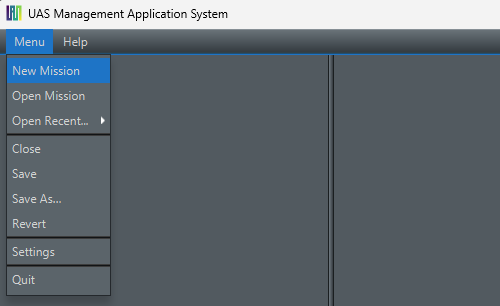
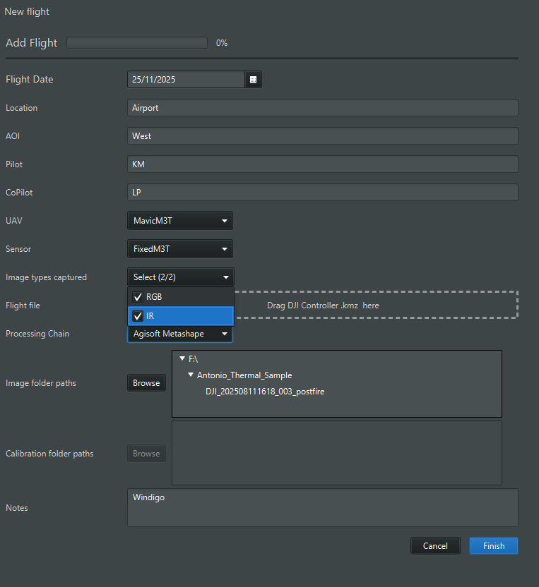
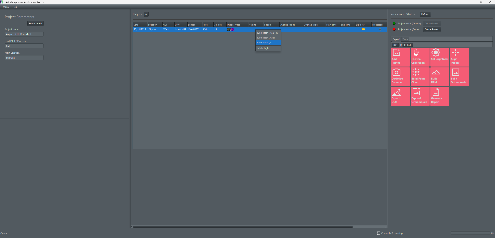

# Welcome to UMAS
### A free and open source (DJI) UAS Flight Managment System developed by the Earth Observation Research Cluster 🌍

### Quickstart Guide (only for interns)
Open up Intellij and find the Main class file. Hit run in the top right corner to execute it.

If you haven't done so far, create a new Mission with `Menu -> New Mission`. You can quickly access the mission later by `Menu -> Open Recent` or manually search for the project file which has a `.umasproject` suffix with `menu -> Open Mission`. When creating a new mission, select the a drive (e.g., `B:/1_Projects` or `D:/1_Projects`) as your base directory, depending on the Working station you are working from. \

Add a fight by clicking the plus icon above the center table and fill out the paperwork :bookmark_tabs:. Select you Drone and Sensor you flew with; also mark the fields which types of data you captured for this flight. Hit Finish and wait for the flight to be copied. **You can add multiple flights in parallel. However, they cannot copy from the same directory for now (god knows why).**.

Yo may also upload the kmz-mission file via drag and drop to visualize the flight path. Although, this is still in a pre-version and has a lot of bugs.

## Processing
To process your flight, go to the right side of the flight-table and click the gear icon. If not already existing, create an Agisoft (or Terra) project, based on which processing chain was selected in the add-flight window. You'll be prompted with all combinations of workflows available for the data that was acquired. To start processing, leftclick all processing steps in order (how you would do in Agisoft). You can put the next setp (e.g., *Align Photos*) also already into the processing queue while e.g., *Add Photos* is s still running. \

For a much faster processing experience and more free time to drink some limo, you can right click a flight (or also multiple flights) within the flight table and hit batch process.

To get the results, just go to the folderstructure that was created within the mission directory `Base path -> "Your mission" -> "My flight" -> 4_RawOutput`.

Cheers, Caipi
